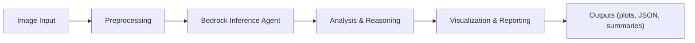

# PPE Compliance Detection – Workflow Demo

This repository contains a complete workflow demonstrating automated **PPE (Personal Protective Equipment) compliance detection** using a modular, multi‑agent architecture and AWS Bedrock–powered inference.

The project is designed as an **extensible demo** that can be adapted into production‑grade safety and compliance solutions.

---

## ✨ Key capabilities

- **PPE detection workflow** from image ingestion to structured results  
- **Multi‑agent orchestration** for analysis, reasoning, and visualization  
- **Bedrock‑backed inference** using Claude models for multimodal understanding  
- **Plotting and reporting** for visual inspection of results  
- **Clean, modular Python design** suitable for extension and integration

---

## 🏗️ Architecture overview

At a high level, the workflow:

1. **Ingests images** (e.g., workers in industrial environments)
2. **Preprocesses and encodes** them for model consumption
3. **Invokes Bedrock models** for PPE detection and reasoning
4. **Aggregates and structures** the results
5. **Generates plots/reports** for human review or downstream systems

